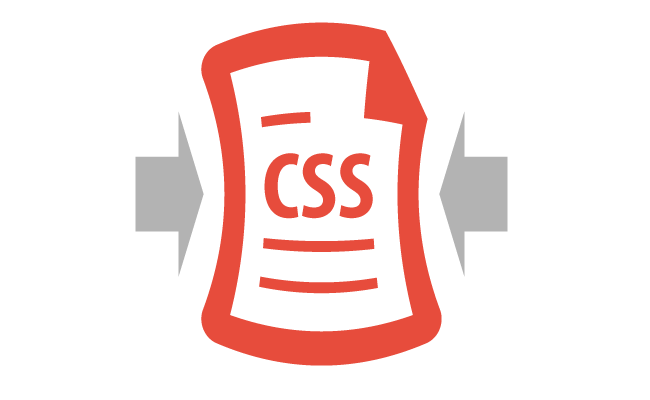

<h1 align="center">
    
</h1>

<h1 align="center">Hi, In this Repo you can use npm package codes</h1>

---

## You must have `NodeJs` installed for these commands to work

##  [Node.js Download](https://nodejs.org/en/download)

---

#  PUG


## PUG Install NPM 
```bash
npm i pug
```

## Watch PUG File, `Converts PUG to HTML` 
```bash
pug -w ./ -o ./html -P
```

### This code is hard to remember, so I recommend adding the **`"pug": "pug -w ./ -o ./html -P"`** command between the script tag in the `package.json` file.

### Script command to shorten, in such a way
### 
```json
 "scripts": {
    "test": "echo \"Error: no test specified\" && exit 1",
    "pug": "pug -w ./ -o ./html -P"
  },
```
### and then
```bash
npm run pug
```

### attack `ctrl+c`

---

#  SASS


## SASS, SCSS Install NPM 
```bash
npm i sass
```

## Watch SASS File, `Converts SASS to CSS` 
```bash
sass -w sass/
```

### This code is hard to remember, so I recommend adding the **`"sass -w sass/"`** command between the script tag in the `package.json` file.

### Script command to shorten, in such a way
### 
```json
 "scripts": {
    "test": "echo \"Error: no test specified\" && exit 1",
    "sass": "sass -w sass/"
  },
```

### and then
```bash
npm run sass
```

### attack `ctrl+c`

---

#  BOOTSTRAP


## Bootstrap Install NPM 
#### If you simply type npm i bootstrap you will download the latest version of bootstrap
```bash
npm i bootstrap
```

### If you want to download the version of bootstrap you want, you can see in the example below, here is the code for bootstrap version 5.3.3
```bash
npm install bootstrap@5.3.3
```
# Bootstrap Icons via npm
## Using bootstrap icons using npm
```bash
npm i bootstrap-icons
```
## Binding bootstrap icons to html
```html
<link rel="stylesheet" href="/node_modules/bootstrap-icons/font/bootstrap-icons.css">
```

---

#  PERCEL


## Percel Install NPM 

### Parcel recall

```bash
npm install --save-dev parcel
```

### run
```bash
npx parcel ./index.html
```

### Watch
```bash
http://localhost:1234/
```

### This code is hard to remember, so I recommend adding the **`"dev": "npx parcel ./index.html"`** command between the script tag in the `package.json` file.

### Script command to shorten, in such a way
### 
```json
 "scripts": {
    "test": "echo \"Error: no test specified\" && exit 1",
    "dev": "npx parcel ./index.html"
  },
```

### and then 

```bash
npm run dev
```

---

#  MINIFY CSS


## MINIFY Install NPM 

### install

```bash
npm install --save-dev parcel
```
<!--  -->

```bash
npm install css-minify -g
```

<!--  -->

### next watch

### Be sure that filename must be ended with ".css"

```bash
css-minify -f filename
```

### or

```bash
css-minify --file filename
```

# ||

```bash
css-minify -d sourcedir -o distdir
```

### or

```bash
css-minify --dir sourcedir --output distdir
```

### This code is hard to remember, so I recommend adding the **`"min": "css-minify -f ./css/style.css"`** command between the script tag in the `package.json` file.

### Script command to shorten, in such a way
### 
```json
 "scripts": {
    "test": "echo \"Error: no test specified\" && exit 1",
    "min": "css-minify -f ./css/style.css"
  },
```

### end then

```bash
npm run min
```

---

#  TAILWIND ~


## TAILWIND Install NPM 
```bash
npm install tailwindcss
```

### init
```bash
npx tailwindcss init
```

#### Add the paths to all of your template files in your `tailwind.config.js` file.
```json
/** @type {import('tailwindcss').Config} */
module.exports = {
  content: ["./**/*.{html,js}"],
  theme: {
    extend: {},
  },
  plugins: [],
}
```

#### Add the Tailwind directives to your CSS, Add the @tailwind directives for each of Tailwind’s layers to your main CSS file.
### add this code ./src/`input.css`👇👇👇
```css
@tailwind base;
@tailwind components;
@tailwind utilities;
```


## Start the Tailwind CLI build process
#### Watch Tailwind, `Converts TAILWIND to CSS` 
```bash
npx tailwindcss -i ./src/input.css -o ./src/output.css --watch
```

### This code is hard to remember, so I recommend adding the **`"twind": "npx tailwindcss ...  --watch"`** command between the script tag in the `package.json` file.

### Script command to shorten, in such a way
### 
```json
 "scripts": {
    "test": "echo \"Error: no test specified\" && exit 1",
    "twind": "npx tailwindcss -i ./src/input.css -o ./src/output.css --watch"
  },
```

### Start using Tailwind in your HTML
```html
<link href="./src/output.css" rel="stylesheet">
```

### and then
```bash
npm run twind
```

### attack `ctrl+c`

---